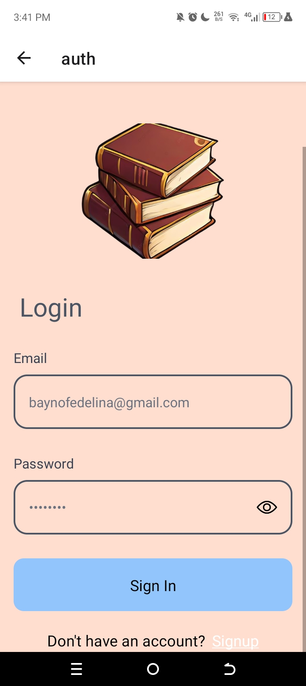
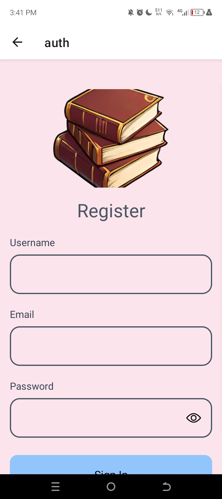
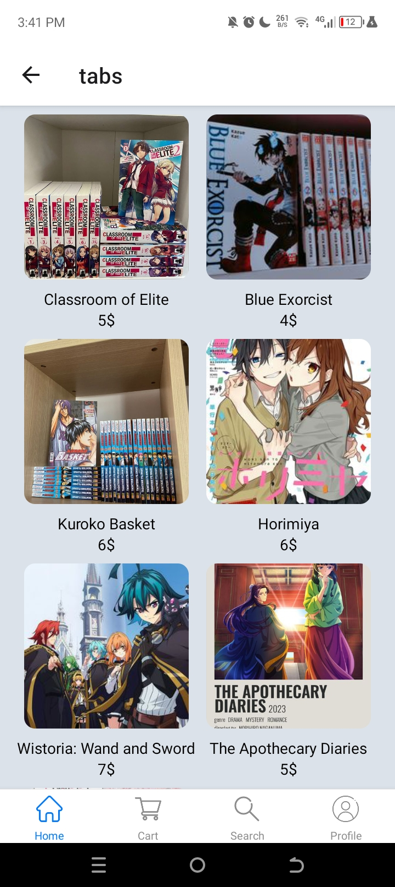

# AnimeBookCollection
AnimeBookCollection Mobile App.

# Features
* Social & Community Integration
* Explores and reading.
* Suggests new books or manga based on your reading history, preferences, and genres.
* Mark their favorite pages or parts of the story for quick access later.

# Tech Stack
* React Native
* AppWrite
* HTML, CSS and JS

  

# Sign Up Screen
  

# Sign In Screen
  

# Tabs Screen
  

# Walkthrough
<https://youtube.com/shorts/rel3qJc78IE?feature=share>
